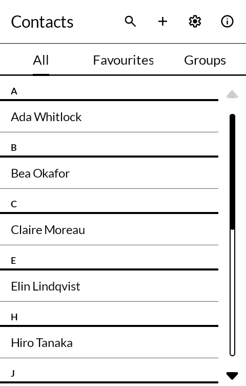
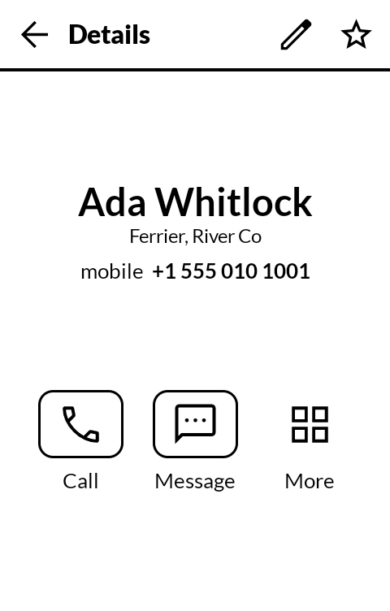
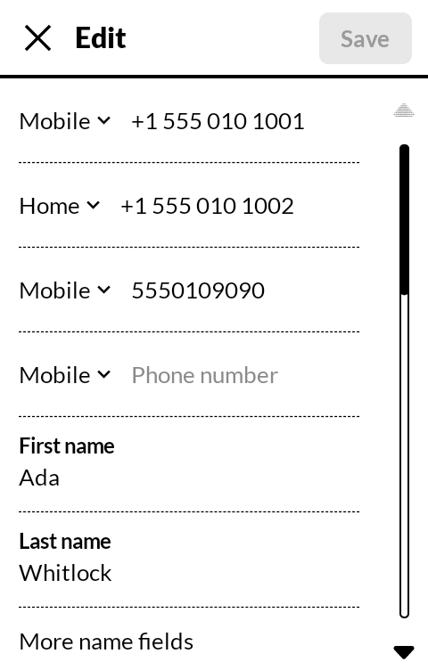
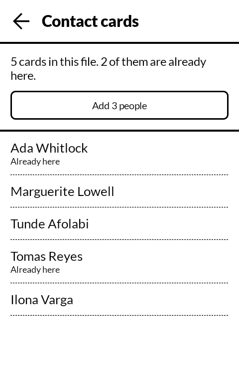

# 縁 enishi — Contacts

An address book for an E Ink phone. Built for the
[Mudita Kompakt](https://mudita.com/products/kompakt/), and it will install on any Android 12
device.

*Enishi* is 縁, the ties between people. The word means the thread that runs from one person to
another, not a list of names.

Not a fork. Written from scratch in Kotlin and Jetpack Compose, using Mudita's own
[MMD](https://github.com/mudita/MMD) design system, and drawn to sit beside the Kompakt's own
contacts app: the same bold title, plain list with the surname in bold, dotted rules, and
Call, Message and More under a person's name. What it does is modelled on
[Fossify Contacts](https://github.com/FossifyOrg/Contacts), which sets the bar for a contacts
app that is free software.

| | |
|---|---|
|  |  |
|  |  |

## Why it exists

A contacts app is the one every other app leans on. Messaging asks it to show a person, add a
number or pick someone for a card; Email asks it to add a sender or find a recipient. This is
the address book those apps can count on, drawn for sixteen greys and a list that moves a page
at a time.

## What it does

- **Everyone in one plain list**, in the phone's own language and order, the surname in bold.
- **Favourites as the phone keeps them**: a star on a person's page, and they are in the Phone
  app's Favorites, as with the phone's own contacts app.
- **Choose several at once** with a long press, then merge, share or delete them together.
- **Merge duplicates by hand**: choose whose name stays, and every number, address, note and
  photo the others have is added to that person, nothing written twice. A copy a messenger keeps
  is joined rather than deleted.
- **Call and Message under a person's name**, and More for everything else they have: a press on
  any number calls it, on an address opens it in a map, on an email address writes to it.
- **Search** by any part of a name, a run of digits from any number, or part of an email
  address or a company. Accents and capitals do not count.
- **Edits only what changed.** A photo, a ringtone or a messenger handle written by another app
  is never touched by a save here, because nothing here edits it.
- **Birthdays with or without a year**, entered in the order the phone writes a date. A switch
  under the birthday, **Add to calendar**, puts it in a "Birthdays" calendar kept on the phone,
  every year, shown by any calendar app.
  Change the name or the day here and the calendar follows.
- **Contact cards (.vcf)**: open one received in a message and add the person from it; read a
  whole address book from another phone, with anyone already here left alone rather than added
  twice; save everyone to one file any phone can read; share a person as a card.
- **Automatic backups**: everyone saved to a folder you choose, every day or every week, the
  newest ten files kept.
- **Answers every standard request other apps make**: show a person, add someone, add a number
  or an address to someone, show or add the sender of an email, pick a person, a number, an
  email address or a postal address. Done, it goes back to the app that asked.
- **Accounts.** Where a phone syncs contacts to an account, new people go where most already
  are, or wherever you choose.

## What it does not do

No photographs: a face the size of a list row is a grey smudge on this screen, so none are
shown — and none are lost, because a save leaves them where they are. Nothing is sent anywhere:
the app has no internet permission at all.

## Where this is up to

Version 0.1.9. What it writes is worked out by plain code that is unit tested on its own: which
rows a save adds, changes and deletes; how vCards from 2.1 to 4.0 read, including old phones'
quoted-printable in other character sets; dates without a year; search; who in a file is
already here; what a merge adds and what it leaves.

Every screen has been driven on an Android 12 emulator the size of a Kompakt, and so has every
request Messaging and Email make of it: Messaging's real "Attach a contact" came back as the
right contact card, and its "Add to contacts" saved the number it handed over.

## Building

```
./gradlew assembleDebug
```

A release build needs a keystore at `signing/signing.keystore` with a matching
`signing/signing.properties`. There is no fallback key in this repository: without one, a
release build comes out unsigned rather than wrongly signed.

## Getting it, and keeping it

Download <https://github.com/wanderwildwood/enishi/releases/latest/download/enishi.apk> and
sideload it. That address always points at the newest release, and every release publishes a
`.sha256` beside the APK if you would rather check than trust.

For updates without doing this by hand, add this repository to
[Obtainium](https://github.com/ImranR98/Obtainium):

    https://github.com/wanderwildwood/enishi

It will offer each new release as it appears. **The application id is settled** — updates
install over what you have, keeping your settings and anything the app has stored.

## Licence

GPL-3.0-only. See [LICENSE](LICENSE).

Copyright (C) 2026 wander wildwood

This program is free software: you can redistribute it and/or modify it under the terms of the
GNU General Public License as published by the Free Software Foundation, version 3.

This program is distributed in the hope that it will be useful, but WITHOUT ANY WARRANTY;
without even the implied warranty of MERCHANTABILITY or FITNESS FOR A PARTICULAR PURPOSE. See
the GNU General Public License for more details.

You should have received a copy of the GNU General Public License along with this program. If
not, see <https://www.gnu.org/licenses/>.

An address book is a list of everyone a person knows. Copyleft means nobody can ship this code
with something added that they will not show you.

Icons are from Material Symbols, Apache 2.0.
